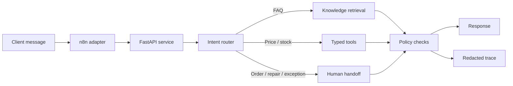

# Retail AI Sales Agent

Sanitized prototype of an AI-assisted retail sales agent.

This repository is a clean public reconstruction of a retail assistant workflow. It shows how a chat-based sales agent can combine deterministic routing, retrieval from a small knowledge base, typed tools for commercial facts, human handoff rules, traces, and regression tests.

The project does not include real customer conversations, tokens, internal URLs, CRM schemas, brand data, or production exports. Product records and knowledge base documents are synthetic.

- [Русская версия](#русская-версия)
- [English Version](#english-version)

## Русская Версия

### Назначение

Проект показывает прототип AI-консультанта для розничных продаж. Агент принимает сообщение клиента, определяет тип запроса и выбирает безопасное действие:

- ответить по базе знаний;
- проверить цену через типизированный инструмент;
- проверить наличие через типизированный инструмент;
- задать уточняющий вопрос;
- передать диалог оператору.

Идея проекта не в том, чтобы заменить CRM или оператора, а в том, чтобы отделить рутинные ответы от случаев, где нужно решение человека.

### Что есть в репозитории

- FastAPI-сервис с endpoint для чата;
- простой router для интентов;
- локальный retrieval по синтетической базе знаний;
- typed tools `get_price` и `check_stock`;
- правила handoff для заказов, ремонта, скидок, опта и неясных ситуаций;
- trace endpoint с маскированием телефона, e-mail и номера заказа;
- idempotency через `request_id`;
- regression evals для типовых ошибок;
- минимальный обезличенный n8n workflow.

### Как проходит запрос



### Ограничение галлюцинаций

Проект использует несколько простых ограничений:

- цены и наличие возвращаются только инструментами, а не текстом модели;
- при слабом совпадении в поиске агент просит уточнение;
- вопросы по заказам, ремонту, скидкам, опту и спорным ситуациям передаются человеку;
- trace сохраняет маршрут решения и вызовы инструментов;
- ошибки поведения превращаются в regression tests;
- если подключен LLM-провайдер, ответ проверяется на новые числа: если модель добавила число, которого не было в контексте, используется deterministic fallback.

Это не полная защита от всех ошибок LLM. Это небольшой набор проверок, который снижает риск неверных коммерческих обещаний.

### Пример

Запрос:

```json
{
  "session_id": "demo-42",
  "request_id": "crm-event-1001",
  "message": "Хочу купить D210, как будет доставка?"
}
```

Ответ:

```json
{
  "intent": "purchase",
  "action": "ask_confirmation",
  "response": "Northstar Diver D210 есть в наличии, цена - 34 900 RUB. Хотите оформить заказ прямо сейчас?",
  "tool_calls": [
    {"name": "get_price", "arguments": {"product_id": "NW-D210"}},
    {"name": "check_stock", "arguments": {"product_id": "NW-D210"}}
  ]
}
```

После отдельного подтверждения API возвращает `human_handoff`. Закрывающие фразы вроде "спасибо" не считаются подтверждением покупки.

### Быстрый запуск

Требуется Python 3.11+.

```bash
python -m venv .venv
source .venv/bin/activate
pip install -e ".[dev]"
uvicorn sales_agent.api:app --reload
```

Для Windows:

```powershell
python -m venv .venv
.venv\Scripts\activate
pip install -e ".[dev]"
uvicorn sales_agent.api:app --reload
```

Swagger UI:

```text
http://127.0.0.1:8000/docs
```

Тесты и evals:

```bash
pytest
python -m sales_agent.eval_runner
```

Docker:

```bash
docker compose up --build
```

### Структура

```text
src/sales_agent/     API, router, tools, retrieval, traces
data/                synthetic product catalog and knowledge base
tests/               unit and API tests
evals/               regression cases and report
n8n/                 sanitized integration workflow
docs/                architecture notes and limitations
examples/            sample API requests
```

### Границы публичной версии

Публичная версия заменяет реальные интеграции синтетическими и локальными компонентами. В ней нет CRM, реальных складских данных, клиентских диалогов, внутренних адресов, credentials и production n8n export.

Исходная система могла использовать CRM, сайт, складские источники, базу знаний, обработку медиа и операторские каналы. В этом репозитории оставлены только те части, которые помогают показать архитектуру и подход без раскрытия внутренних деталей.

### Ограничения

- Это clean-room prototype, а не выгрузка production-кода.
- Локальный retrieval нужен для воспроизводимого демо и не заменяет полноценную поисковую инфраструктуру.
- Состояние диалога и traces хранятся в памяти процесса.
- Данные каталога и базы знаний синтетические.
- Бизнес-эффект в цифрах не заявляется.

## English Version

### Purpose

This project demonstrates a prototype of an AI-assisted retail sales agent. The agent receives a customer message, classifies the request, and chooses a controlled action:

- answer from a knowledge base;
- check price through a typed tool;
- check stock through a typed tool;
- ask a clarification question;
- hand the conversation off to a human operator.

The goal is not to replace a CRM or a sales team. The goal is to show how routine answers can be separated from cases that require a human decision.

### Repository Contents

- FastAPI service with a chat endpoint;
- deterministic intent router;
- local retrieval over a synthetic knowledge base;
- typed tools `get_price` and `check_stock`;
- handoff rules for orders, repairs, discounts, wholesale requests, and unclear situations;
- trace endpoint with phone, email, and order-number redaction;
- idempotency through `request_id`;
- regression evals for common failure cases;
- minimal sanitized n8n workflow.

### Request Flow


### Hallucination Controls

The prototype uses a few practical constraints:

- prices and stock availability come from tools, not from generated text;
- weak retrieval matches lead to a clarification question;
- orders, repairs, discounts, wholesale requests, and ambiguous cases are handed off to a human;
- traces record the decision path and tool calls;
- behavior bugs are converted into regression tests;
- when an LLM provider is configured, generated answers are checked for new numbers: if the model introduces a number that is not present in the provided context, the service returns a deterministic context-only fallback.

This does not eliminate every possible LLM error. It is a small control layer aimed at reducing incorrect commercial claims.

### Example

Request:

```json
{
  "session_id": "demo-42",
  "request_id": "crm-event-1001",
  "message": "I want to buy D210. What about delivery?"
}
```

Response:

```json
{
  "intent": "purchase",
  "action": "ask_confirmation",
  "response": "Northstar Diver D210 is in stock, price is 34,900 RUB. Would you like to place the order now?",
  "tool_calls": [
    {"name": "get_price", "arguments": {"product_id": "NW-D210"}},
    {"name": "check_stock", "arguments": {"product_id": "NW-D210"}}
  ]
}
```

Only a separate explicit confirmation leads to `human_handoff`. Closing phrases such as "thanks" are not treated as purchase confirmation.

### Quick Start

Requires Python 3.11+.

```bash
python -m venv .venv
source .venv/bin/activate
pip install -e ".[dev]"
uvicorn sales_agent.api:app --reload
```

For Windows:

```powershell
python -m venv .venv
.venv\Scripts\activate
pip install -e ".[dev]"
uvicorn sales_agent.api:app --reload
```

Swagger UI:

```text
http://127.0.0.1:8000/docs
```

Tests and evals:

```bash
pytest
python -m sales_agent.eval_runner
```

Docker:

```bash
docker compose up --build
```

### Structure

```text
src/sales_agent/     API, router, tools, retrieval, traces
data/                synthetic product catalog and knowledge base
tests/               unit and API tests
evals/               regression cases and report
n8n/                 sanitized integration workflow
docs/                architecture notes and limitations
examples/            sample API requests
```

### Public Version Scope

The public version replaces real integrations with synthetic and local components. It does not include CRM access, real stock data, customer conversations, internal URLs, credentials, or the original production n8n export.

The original system could include CRM channels, website data, inventory sources, a knowledge base, media processing, and operator handoff. This repository keeps only the parts needed to demonstrate the architecture and engineering approach without exposing internal details.

### Limitations

- This is a clean-room prototype, not a production code export.
- Local retrieval is used for a reproducible demo and is not a replacement for a full search stack.
- Dialog state and traces are stored in process memory.
- Product and knowledge base data are synthetic.
- No business impact metrics are claimed.

## License

MIT.
